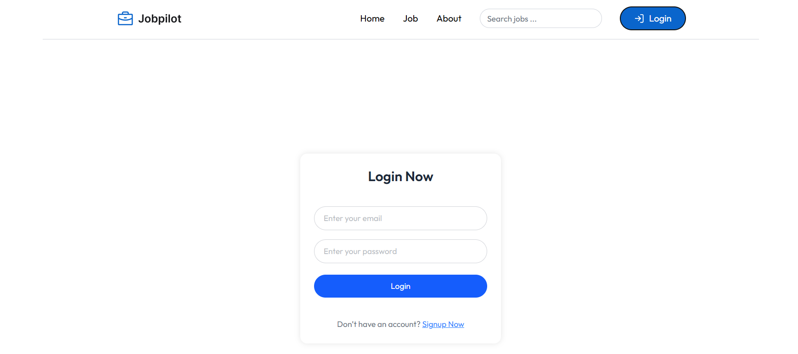
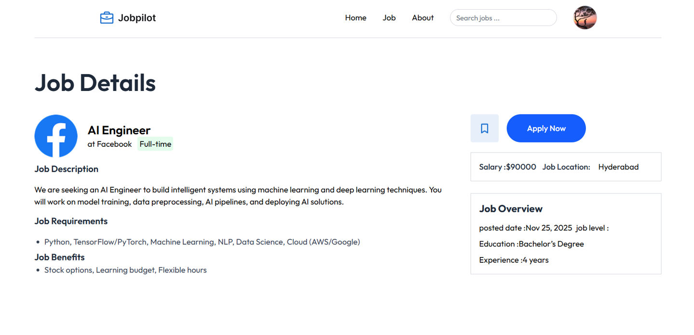
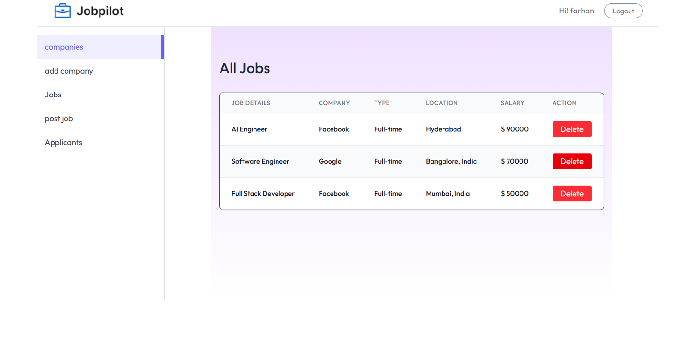

# 🧭 JobPilot – MERN Stack Job Portal

A production-ready **MERN Job Portal** with complete **role-based dashboards** for Students, Employers, and Admins.  
Includes secure authentication, job posting, applications, company management, and full admin control.

---

## 📂 Project Structure

```
JobPilot/
├── backend/                 
│   ├── config/             
│   ├── controllers/        
│   ├── middlewares/        
│   ├── models/             
│   ├── routes/             
│   ├── uploads/            
│   ├── index.js            
│   └── package.json        
│
├── frontend/               
│   ├── src/                
│   │   ├── assets/         
│   │   ├── components/     
│   │   ├── context/        
│   │   ├── pages/          
│   │   ├── App.jsx         
│   │   └── main.jsx        
│   ├── index.html          
│   └── package.json        
│
└── README.md
```

---

## 🚀 Quick Start (Local)

### **Prerequisites**
- Node.js (18+ recommended)
- MongoDB Atlas account (or local MongoDB)
- npm / yarn

---

## 1️⃣ Backend Setup

```
cd backend
npm install
```

Create a **.env** file inside backend:

```
PORT=4000
MONGO_URI=your_mongodb_url
JWT_SECRET_KEY=your_secret_key

# Default Admin Credentials
ADMIN_EMAIL=admin@gmail.com
ADMIN_PASSWORD=Admin@123
```

Start backend server:

```
npm run dev
```

Backend runs on:  
👉 **http://localhost:4000**

---

## 2️⃣ Frontend Setup

```
cd frontend
npm install
```

Create **.env** inside frontend:

```
VITE_API_URL=http://localhost:4000
```

Start frontend:

```
npm run dev
```

Frontend runs on:  
👉 **http://localhost:5173**

---

## 📌 Features

### 👨‍🎓 Student / Job Seeker
- Signup / Login
- Browse jobs
- View job details
- Apply to jobs
- View applied jobs
- Manage personal profile

### 🏢 Employer
- Add new company
- Manage companies
- Post jobs
- Manage posted jobs
- View applicants
- Update applicant status (Pending / Accepted / Rejected)

### 🔐 Admin
- Manage categories
- Manage students
- Manage employers
- Manage companies
- Manage posted jobs
- View all applications

---

## 🧰 Tech Stack

### 🔹 Frontend
- React
- Vite
- Tailwind CSS
- React Router
- Axios
- Context API

### 🔹 Backend
- Node.js
- Express.js
- MongoDB + Mongoose
- JWT Authentication
- Bcrypt
- Multer
- Cookie-Parser

---

## 🖼 Screenshots (Add your images here)







---

## 👨‍💻 Developer

**Built and customized by Farhan Gheri — Job Portal Project.**
